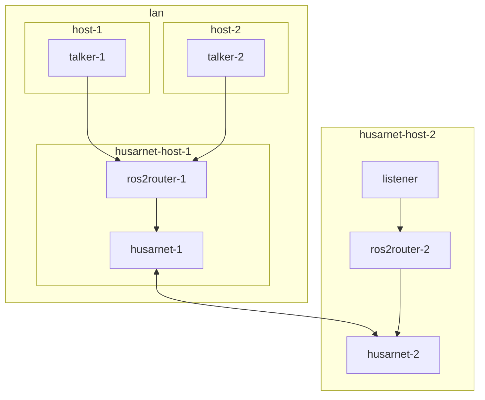

# husarnet-ros2-bridge-lan



The aim of this project is to show how to bridge local non-husarnet powered devices working in LAN with ROS 2 nodes running on the remote (in different LAN) Husarnet powered device.

## Quick Start

Modify the `.env` file and paste your `JOINCODE` here:

```
JOINCODE=fc94:b01d:1803:8dd8:b293:5c7d:7639:932a/xxxxxxxxxxxxxxxxxxxxxxxxxx
```

## 1st terminal

```
docker compose -f compose.talker.yaml up
```

## 2nd terminal

You can run this also on the remote host

```
docker compose -f compose.listener.yaml up
```

## Why?

Note that these containers:

```yaml
  host-1:
    build: .
    command: ros2 run demo_nodes_cpp talker

  host-2:
    build: .
    command: ros2 run demo_nodes_cpp talker
```

Are in the same docker network as these containers (`husarnet` and `ros2router` share the same network namespace, so they can be considered as a single host within a local Docker network )

```yaml
  husarnet:
    image: husarnet/husarnet:2.0.180
    # ...

  ros2router:
    image: husarnet/ros2router:1.6.0
    network_mode: service:husarnet
    # ...
```

On the other hand we run containers on the second Husarnet host within the same network namespace (and additionally with a shared memory config only setup to make sure no traffic goes thgrouh the LAN network):

```yaml
  husarnet:
    image: husarnet/husarnet:2.0.180
    ipc: shareable
    # ...

  ros2router-2:
    image: husarnet/ros2router:1.6.0
    network_mode: service:husarnet
    ipc: service:husarnet
    # ...

  listener:
    build: .
    network_mode: service:husarnet
    ipc: service:husarnet
    volumes:
      - ./shm-only.xml:/shm-only.xml
    environment:
      - FASTRTPS_DEFAULT_PROFILES_FILE=/shm-only.xml
    command: ros2 run demo_nodes_cpp listener
```